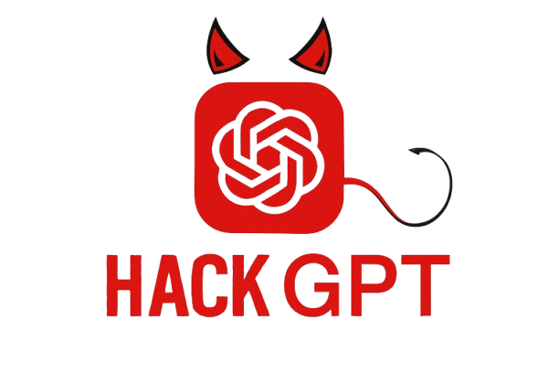

<p align="center">
  
</p>

<p align="center">
  <a href="https://t.me/Pycodz">
    
  </a>
  
  <a href="https://t.me/DevZ44d" target="_blank">
    
  </a>
</p>


### 📚 HackerGPT Telegram Bot .

> [!IMPORTANT]
> **HackerGPT** is an advanced Telegram bot tailored for **cybersecurity professionals**, **ethical hackers**, **malware analysts**, and **penetration testers**. It leverages AI to assist users in **vulnerability analysis**, **security script generation**, and **cybersecurity research** — all within Telegram chats.


### 💡 Features :
- AI-powered cybersecurity assistant: Ask complex questions related to hacking, vulnerability scanning, malware, and more.

- Multi-language support: English and Arabic interfaces with easy toggling.

- Group mode with activation keyword: In group chats, users must send a message containing the keyword "dark" to activate the bot for their messages, preventing unwanted spam.

- Chat history: Stores user conversations in an SQLite database, allowing users to review recent chat history.

### 💬 Commands:

- `/start` — Welcome message with bot info and language selection.

- `/new_chat` — Clears user's chat history.

- `/history` — Shows the last 10 messages exchanged.

- Interactive buttons: Easy navigation through menus and language toggling via inline buttons.

- Spoiler photos: Sends messages with spoiler images to keep the chat neat.

### 🛠 How It Works:
- In private chats, the bot responds to all user messages.

- In group chats, the bot only responds to users who have activated it by including the word "dark" in their first message. This feature helps reduce noise and ensures intentional usage.


### Via `Git` ( Recommended ) ⚡️
```shell
# via Git
git clone https://github.com/DevZ44d/HackerGPT-Telegram-Bot.git

cd HackerGPT-Telegram-Bot

python3 main.py
```

## 💬 Help & Support .
- Follow updates via the **[Telegram Channel](https://t.me/Pycodz)**.
- For general questions and help, join our **[Telegram chat](https://t.me/PyChTz)**.